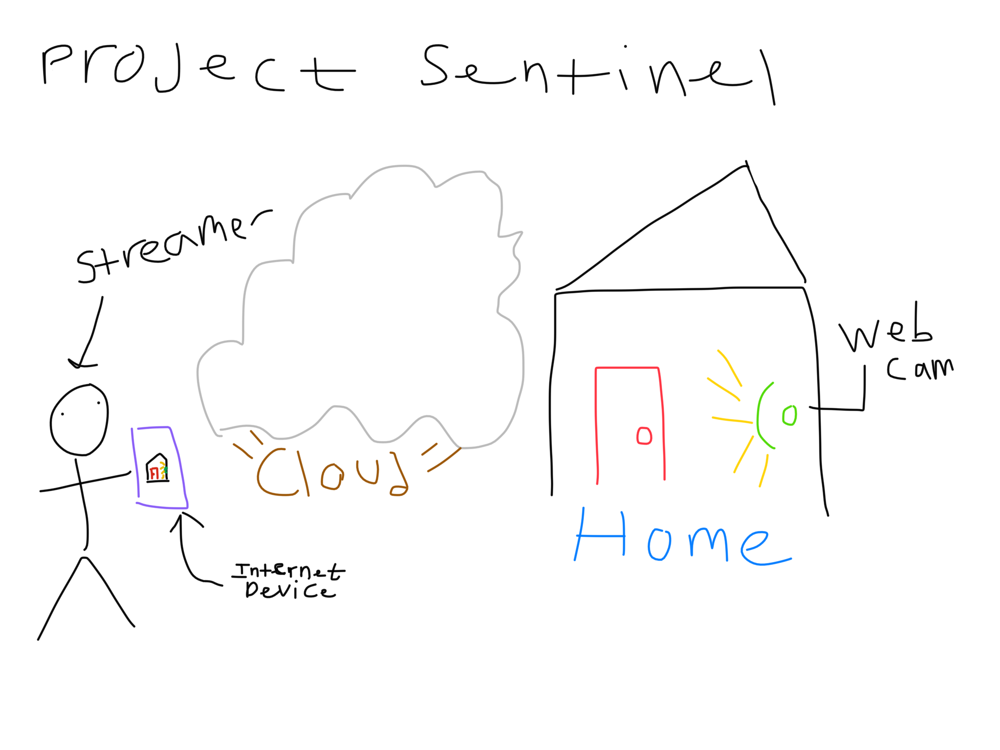
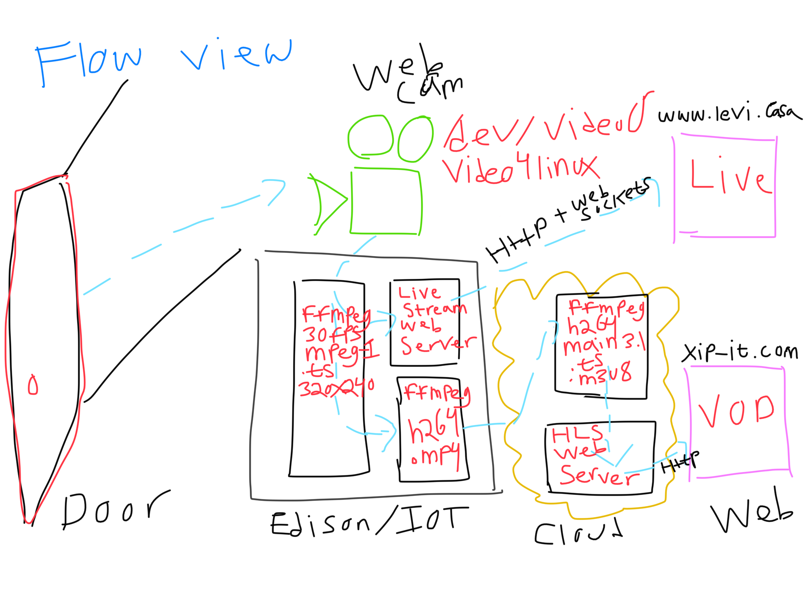

# Project Sentinel

**why** does it need to exist?

**what** does it do?

**so**, and then what?

## Why

### Goals
Ability to view live stream of home entrance.

POC the ability to receive notification of entry into the house.

Point in time verification of home entrance state.

Have a source of visual feedback and continuous flow of realistic conditions, objects, and events in my home that can power future streaming media and Machine Learning projects and goals.

4 the lolz, err, to provide proof of resourcefulness, skill, and reasoning in the domain of streaming media and server-side programming.

### Non Goals
Production/$ services or [devices](https://www.apple.com/shop/product/HL982VC/A/logitech-circle-2-indoor-outdoor-weatherproof-wired-security-camera)

## What

### Pictures

### Words

I have a home.

Video is captured by a camera in my home.

My camera is connected over USB to an IOT server.

The IOT server runs a 32 bit Linux OS, and is connected to the home wi-fi network.

The IOT server runs a few processes.

 - The first IOT server process reads video from the USB camera, and encodes it into two streams.
 - The second IOT server process receives one of these streams and broadcasts copies of it over websockets to web clients.
 - The third IOT server process receives the other one of these streams, and transcodes it from MP1 to h264, packages it into an MP4 container, and uploads the transcoded file to a remote server.

I have a remote server.

The remote server runs three processes.

  - The first remote server process continuously polls for MP4 files on the disk, and for each found MP4 file creates HLS segments, manifests, and playlist for that file.
  - The second remote server process runs a webserver to enumerate the playlists for all VOD segments on disk and play them out to web clients.
  - The third remote server process deletes any HLS (\*.ts, \*.m3u8) files on disk that are older than 7 days.

I go to a web browser.

I see my home in the web browser, one page showing the live stream, and another page showing the last 7 days of recorded video.

### Data

If I was building this as a money making service, these are the numbers I would measure.

For the ones that I have datapoints to at my fingertips, I've provided the answers.

The remaining are left as an exercise to the reader(who at this point in human writing history has to be fit enough to run a 100k with an elephant on her back.) along with hopefully some helpful context as to why they are worth the exercise.

#### Volume

Bytes upladed per hour
    15.64 MB

Bytes stored/week
    2.57 GB

#### Latency
Video coding pipeline latency

Capture

What is the latency introduced by the IOT platform, USB cord, and WebCam from light in the entrance hitting the camera to it being processed by ffmpeg on the IOT server?

A comparison between an external high accuracy timing device that is in the frame of capture and the time stamp produced by the webcam and ffmpeg as it constructs frames should provide an answer.

Time to live

    > Broadcast

        > What is the time it takes from receiving the local copy of the camera capture to serving it over websockets to a connected web client?

Time to VOD

    > Transcoding from the device codec of mpeg1 to h264 introduces an additional amount of latency.

    > Uploading the transcoded live stream to the remote server.

    > Segmenting the uploaded transcoded live stream into HLS segments and creating the manefist and playlsit introduces an additional quanta of latency.

    > Serving the assets from the file system to the web client player is the last mile of latency for the VOD pipeline.

### Utilization/2xxs

Bytes out
    > How many bytes of stored video is actually viewed? Daily? Weekly?

Page loads
    > How many times do clients try to connect to the live and VOD endpoints?

### Cost/5xx
> (Without these the service endpoints can not process a user request)

    >Home - The most variable and highest cost
        > Rent
        > Electricity
        > Internet
        > Wi-fi router.
    > Camera
        > $99
    > Local Server
        > Micro USB cables(for initial flashing and setup)
            $5
    Cloud Server
        $5/month
            1vCPU(intel@2.2GHZ)
            1 TB outbound transfer per month
            25 GB of storage
    Time - The least variable and highest amortizing cost
        Proof of Concept
            2.5 weeks of self-paced work. Under an external deadline project could have been completed in 7-9 days.
        From the top
            If I had to set everything up from scratch:
                Local Server
                    2 hours
                Cloud Server
                    15 minutes

## So

### Evaluation
Live stream VQ sucks!

    Buy a better camera and more powerful IOT capture platform!
    Tune ffmpeg transcoding parameters?

VOD playout is at 2x!

    Switch to 15fps?
    Ask mc!

Inability to access live stream from device on home wi-fi network!

    Up and to the right! Move live stream web server to cloud.
    Write more Javascript?
    I'm currently hard coding the address that  live content is streamed from to be the IP of my home Comacast router.
    In order to view the stream while on wi-fi I have to update the page to point to the IOT devices local network 10.x.x.x address.
    I'm sure some bit of request inspecting and if/else switch can be used to determine whether to use the local or public ip address of the server.

Unsupervised processes!!

    Buy a 64bit modern IOT device and containerize all the things!
    The Intel Edison is 32 bit and platforms like Docker don't run on 32 bit hardware.
    On the cloud server side I could have setup docker or run the bash scripts as systemd services but a.) not being able to do it end to end seemed to defat the point and b.) it's a hobby project. If something is down it will became important only if I look, and if I look, I can fix.

### Fast Follows(PRs welcome)
Eyes on glass alerts; Health checking that the server and the streams are up.

Door open alerts.

Identification & time series database of color/light conditions in the entrance.

Identification & time series database of faces in stream.

A video isn't cool, you know whats cool? Video *and* audio.

Multiple camera feeds - home network operations center.

